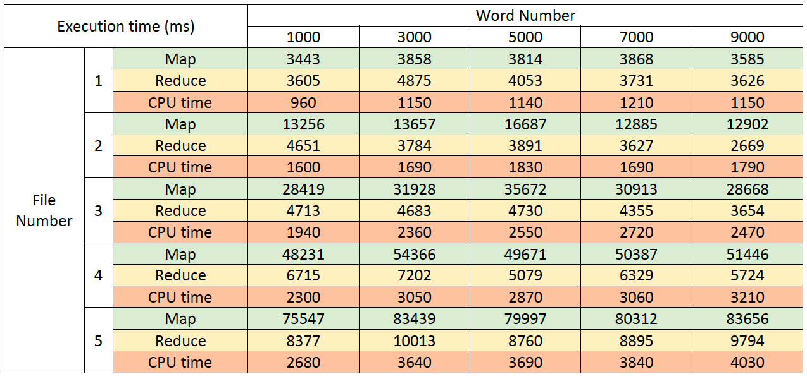
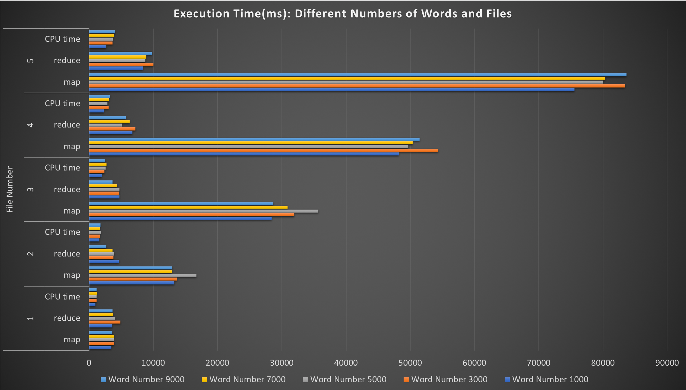

# MapReduce
## Techniques
* Apache Hadoop
* Hadoop Distributed File System (HDFS)
* Java
## WordCount performance analysis
* I use a random paragraph generator to produce files having different **numbers of words** (1000, 3000, 5000, 7000, 9000) and different **numbers of files** (1, 2, 3, 4, 5) as input data. Then I execute these 25 combinations by the Word Count map-reduce program and recorded the map time, reduce time and CPU time separately. The results are as follows: 

* From the chart, we can find that the word count has a small impact on the execution time. However, the performance of mapping has **highly positive correlation** with the number of files.
It is reasonable because each file has its own map task and then reduced together, so more input files need more time for mapping.

